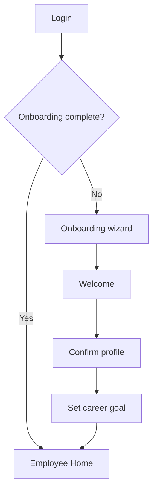
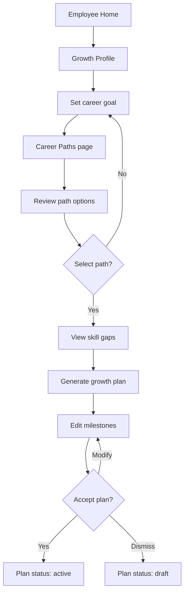
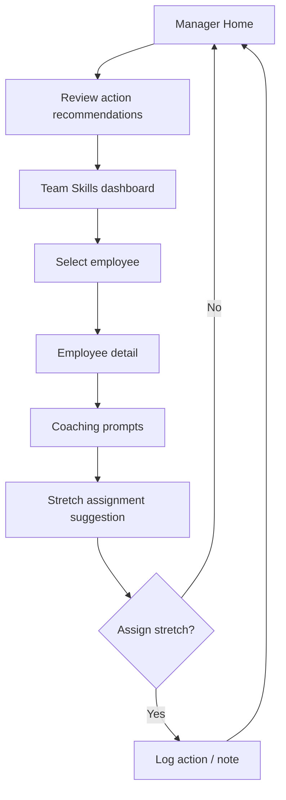
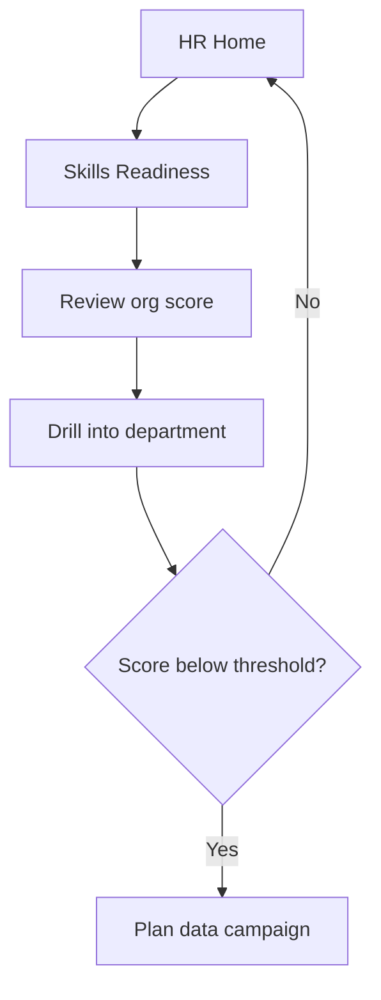

# GrowthOS Application Flow

> **Status**: Canonical source of truth  
> **Version**: 1.0  
> **Last updated**: 2026-06-07  
> **Related docs**: [PRD.md](./PRD.md) | [FRONTEND_GUIDELINES.md](./FRONTEND_GUIDELINES.md) | [BACKEND_STRUCTURE.md](./BACKEND_STRUCTURE.md) | [SECURITY_AND_PRIVACY.md](./SECURITY_AND_PRIVACY.md)

---

## 1. Overview

This document defines all application routes, navigation structure, user journeys, permission-based behavior, empty/error states, and decision points for GrowthOS MVP.

**Layout model**: Authenticated app uses a persistent left sidebar (role-based nav), top bar (org name, user menu, notifications placeholder), and main content area.

---

## 2. Route Inventory

### 2.1 Shared Routes

| Route | Page Title | Auth Required | Roles |
|-------|------------|---------------|-------|
| `/login` | Sign In | No | — |
| `/onboarding` | Welcome to GrowthOS | Yes | All new users |
| `/settings` | Settings | Yes | All |

### 2.2 Employee Routes

| Route | Page Title | FR Reference |
|-------|------------|--------------|
| `/employee/home` | My Growth Home | FR-EMP-001 |
| `/employee/growth-profile` | Growth Profile | FR-EMP-001a, FR-EMP-002, FR-EMP-012 |
| `/employee/career-paths` | Career Paths | FR-EMP-005 |
| `/employee/growth-plan` | My Growth Plan | FR-EMP-008 |
| `/employee/manager-conversation` | 1:1 Prep | FR-EMP-009 |

### 2.3 Manager Routes

| Route | Page Title | FR Reference |
|-------|------------|--------------|
| `/manager/home` | Manager Home | FR-MGR-001 |
| `/manager/team-skills` | Team Skills | FR-MGR-001, FR-MGR-005 |
| `/manager/employee/[id]` | Employee Detail | FR-MGR-002 |
| `/manager/coaching` | Coaching Center | FR-MGR-003 |
| `/manager/team-capability-plan` | Team Capability Plan | FR-MGR-007 |

### 2.4 HR / Admin Routes

| Route | Page Title | FR Reference |
|-------|------------|--------------|
| `/hr/home` | HR Dashboard | FR-HR-001, FR-HR-003, FR-HR-005 |
| `/hr/skills-readiness` | Skills Data Readiness | FR-HR-001 |
| `/hr/mobility-insights` | Internal Mobility | FR-HR-002 |
| `/hr/talent-density` | Talent Density | FR-HR-004 |
| `/hr/workforce-readiness` | Workforce Readiness | FR-HR-006 |
| `/hr/audit` | Audit & Governance Log | FR-HR-007 |

### 2.5 API Routes (Reference)

See [BACKEND_STRUCTURE.md](./BACKEND_STRUCTURE.md) for full API contracts. UI pages consume these via TanStack Query.

---

## 3. Navigation Model

### 3.1 Post-Login Redirect

| User Role(s) | Default Redirect |
|--------------|------------------|
| `employee` | `/employee/home` |
| `manager` (also employee) | `/manager/home` |
| `hr_admin` | `/hr/home` |
| `org_admin` | `/hr/home` |
| `executive_readonly` | `/hr/home` |

Users with multiple roles see a **role switcher** in the top bar (and Settings demo mode). Active role determines sidebar nav.

### 3.2 Sidebar Navigation by Role

**Employee nav**:
- Home
- Growth Profile
- Career Paths
- Growth Plan
- 1:1 Prep

**Manager nav** (additive when manager role active):
- Manager Home
- Team Skills
- Coaching
- Team Capability Plan

**HR nav**:
- HR Home
- Skills Readiness
- Mobility Insights
- Talent Density
- Workforce Readiness

**Shared footer**:
- Settings

### 3.3 Breadcrumbs

All pages below depth 1 show breadcrumbs: `Role Area > Page > [Entity]`

Example: `Manager > Team Skills > Alex Chen`

---

## 4. Page Descriptions

### 4.1 `/login`

- Email/password form (Supabase Auth)
- Link to forgot password (placeholder in MVP)
- On success → check onboarding status → redirect

### 4.2 `/onboarding`

**Steps** (wizard, 3 steps max):

1. Welcome + product value prop
2. Confirm profile (name, title, team)
3. Set initial career goal (optional skip)

On complete → role-based home redirect. Sets `onboarding_completed_at` on employee_profile.

### 4.3 `/settings`

- Profile settings (name, notification prefs)
- Privacy: inferred skills visibility toggle
- **Demo mode**: Role switcher (Employee / Manager / HR) — see OQ-03 in [PRD.md](./PRD.md)
- Sign out

### 4.4 `/employee/home`

**Purpose**: Growth dashboard landing.

**Sections**:
- Greeting + growth status summary
- Active growth plan progress (if any)
- Top 3 skill gaps (quick view)
- Pending recommendations (cards)
- Quick actions: Set goal, View paths, Prep for 1:1

### 4.5 `/employee/growth-profile`

**Purpose**: Canonical employee growth state.

**Sections**:
- Profile header (name, role, tenure)
- Skills summary (chips: confirmed vs inferred; inferred rows support confirm/reject review)
- Career goal card
- Recent recommendations
- Link to career paths and growth plan

### 4.6 `/employee/career-paths`

**Purpose**: Explore and select career direction.

**Sections**:
- Current role context
- Target goal selector
- Recommended paths (cards with explanation, confidence, skill overlap %)
- Skill gap preview per path
- Learning recommendations for selected path gaps (FR-EMP-007) via `learning`-type recommendation cards
- CTA: "Build growth plan from this path"

### 4.6a Internal Opportunities (US-E10 / FR-EMP-012)

Internal opportunity matches are **not** a separate route in MVP. They appear as:

- `mobility`-type `RecommendationCard` items on `/employee/home` and `/employee/growth-profile`
- Invoked via Internal Mobility Agent (`internal-mobility`) from growth-profile `AgentPanel` (Phase 7+)
- Detail shown in recommendation evidence (no external job board)

### 4.7 `/employee/growth-plan`

**Purpose**: 30/60/90 development plan.

**Sections**:
- Plan header (status, target role, dates)
- Timeline: 30 / 60 / 90 day milestones
- Learning items linked to milestones
- Edit milestone / mark complete
- Accept or archive plan

### 4.8 `/employee/manager-conversation`

**Purpose**: Prepare for growth-focused 1:1.

**Sections**:
- Suggested agenda
- Talking points (from Employee Growth Agent)
- Questions to ask manager
- Skills to discuss
- Export/copy prep notes

### 4.9 `/manager/home`

**Purpose**: Manager command center.

**Sections**:
- Team health summary (growth plan adoption %)
- Action recommendations (prioritized)
- Team skill gap alert (if critical gaps)
- Direct report cards (quick status)

### 4.10 `/manager/team-skills`

**Purpose**: Team skills matrix.

**Sections**:
- Skills heatmap or table (employees × key skills)
- Filter by skill category
- Team gap summary
- Drill-down to employee detail

### 4.11 `/manager/employee/[id]`

**Purpose**: Single employee view for manager.

**Sections**:
- Growth summary (plan status, goal)
- Skills (manager-visible only)
- Coaching prompts
- Stretch assignment suggestions
- Link to full growth profile (limited fields)

**Permission**: Only if employee is direct report. Otherwise → 403 page.

### 4.12 `/manager/coaching`

**Purpose**: Coaching prompt library for team.

**Sections**:
- Per-employee coaching cards
- Prompt categories: growth, skills, motivation, project fit
- Mark prompt as used / helpful feedback

### 4.13 `/manager/team-capability-plan`

**Purpose**: Plan team skill development.

**Sections**:
- Team goals (quarter)
- Collective gaps to close
- Suggested team development actions
- Timeline view

### 4.14 `/hr/home`

**Purpose**: HR executive summary.

**Sections**:
- KPI cards: data readiness, adoption (FR-HR-003), mobility, readiness
- Top org skill gaps summary (FR-HR-005) with link to `/hr/workforce-readiness`
- Alerts (low readiness units)
- Quick links to detail pages

### 4.15 `/hr/skills-readiness`

**Purpose**: Data quality dashboard.

**Sections**:
- Org readiness score (0–100)
- Breakdown: confirmed skills %, profile completeness, role mapping
- By department table
- Improvement recommendations

### 4.16 `/hr/mobility-insights`

**Purpose**: Internal mobility analytics.

**Sections**:
- Open internal opportunities count
- Match rate (employees with ≥1 match)
- Interest/applications (mock metrics)
- Top skills in demand for mobility

### 4.17 `/hr/talent-density`

**Purpose**: Simplified talent concentration view (MVP).

**Sections**:
- Skills concentration chart (top skills by depth)
- Departments with highest/lowest density
- Note: Full Talent Density Agent is post-MVP

### 4.18 `/hr/workforce-readiness`

**Purpose**: Skills supply vs. role demand.

**Sections**:
- Role demand list (planned hires / role growth)
- Readiness score per role
- Critical skill shortages
- Workforce enablement assistant (Skills Intelligence agent, org-scoped)

### 4.19 `/hr/audit`

**Purpose**: HR decision context — searchable audit stream for agent invocations, governance blocks, and recommendation actions (FR-HR-007).

**Sections**:
- Filterable event table (action, agent, date range via filters)
- Governance block events (`agent.invocation.blocked`, `recommendation.blocked`)
- Export affordance → `GET /api/hr/audit-logs/export` (CSV)
- RBAC: `hr_admin` and `org_admin` only; managers and employees receive `/forbidden`

---

## 5. Employee Flows

### 5.1 First-Time Onboarding Flow

### 5.2 Career Path → Growth Plan Flow

**Steps**:

1. Employee opens Growth Profile
2. Sets or updates career goal (target role)
3. Navigates to Career Paths
4. System displays ≥2 paths with explanations (Employee Growth Agent + Skills Intelligence)
5. Employee selects a path
6. System shows skill gap analysis
7. Employee clicks "Build growth plan"
8. System generates 30/60/90 plan (Dynamic Learning Agent adds resources)
9. Employee edits if needed
10. Employee accepts → status `active`

**Success path**: Growth plan active; home shows progress.

**Failure paths**:
- No skills data → empty state with "Add confirmed skills" CTA
- Agent timeout → retry banner
- Goal not set → redirect to goal input modal

### 5.3 Manager Conversation Prep Flow

1. Employee opens `/employee/manager-conversation`
2. System loads active growth plan + recent skill changes
3. Employee Growth Agent generates prep content
4. Employee reviews talking points
5. Optional: copy notes or print-friendly view

---

## 6. Manager Flows

### 6.1 Weekly Team Review Flow

### 6.2 Team Capability Planning Flow

1. Manager opens Team Capability Plan
2. Reviews team goals for quarter
3. Views aggregate skill gaps
4. Supermanager Agent suggests team development actions
5. Manager accepts/modifies plan items
6. Plan saved (team-level record or notes in MVP)

**Permission**: Manager sees only direct reports throughout.

---

## 7. HR / Admin Flows

### 7.1 Data Readiness Review Flow

### 7.2 Mobility Insights Flow

1. HR opens Mobility Insights
2. Reviews match rates and open opportunities
3. Identifies departments with low mobility engagement
4. Optional: export summary (post-MVP)

---

## 8. Shared Flows

### 8.1 Authentication Flow

1. User visits `/login`
2. Enters credentials
3. Supabase Auth validates
4. Session established (httpOnly cookie / JWT)
5. App loads user roles from `user_roles`
6. Redirect per Section 3.1

**Failure**: Invalid credentials → inline error. Account disabled → contact admin message.

### 8.2 Role Switching (Demo Mode)

1. User opens Settings
2. Selects demo role: Employee | Manager | HR
3. App reloads sidebar nav
4. Redirect to role-appropriate home
5. Data scope changes per RBAC (mock users may share org)

### 8.3 Recommendation Interaction Flow

Applies to all recommendation cards:

1. Card displays: title, explanation, confidence, evidence links
2. User actions: **Accept** | **Dismiss** | **View details**
3. Accept → updates recommendation status; may update growth plan
4. Dismiss → status `dismissed`; optional feedback
5. All actions logged to `audit_logs`

---

## 9. Empty States

| Page | Condition | Message | CTA |
|------|-----------|---------|-----|
| Employee Home | No growth plan | "Start your growth journey" | Set career goal |
| Growth Profile | No skills | "Build your skills profile" | Add confirmed skills |
| Career Paths | No goal set | "Set a career goal to see paths" | Set goal |
| Growth Plan | No plan | "Create your first growth plan" | Explore career paths |
| Manager Home | No direct reports | "No team members assigned" | Contact HR |
| Team Skills | Empty team | Same as above | — |
| Coaching | No prompts generated | "Check back after growth plans are active" | View team |
| HR Readiness | No employee data | "Import or seed employee data" | Admin docs |
| Mobility | No opportunities | "No internal opportunities published" | Add opportunity (admin) |

**Design**: Follow empty state patterns in [FRONTEND_GUIDELINES.md](./FRONTEND_GUIDELINES.md).

---

## 10. Error States

| Error Type | HTTP/Code | User Message | Recovery |
|------------|-----------|--------------|----------|
| Unauthorized | 401 | "Please sign in again" | Redirect `/login` |
| Forbidden | 403 | "You don't have access to this page" | Link to role home |
| Not found | 404 | "Page not found" | Nav home |
| Agent timeout | 504 | "Growth assistant is taking longer than expected" | Retry button |
| Agent blocked | 422 | "This suggestion couldn't be generated" | Generic safe message; logged |
| Validation error | 400 | Field-level messages | Inline form errors |
| Server error | 500 | "Something went wrong" | Retry; support link |
| Stale data | — | "Data may be outdated" banner | Refresh button |
| Network offline | — | "You're offline" | TanStack Query retry |

**Agent errors**: Never expose raw LLM output on error. Governance-safe fallback copy only.

---

## 11. Permission-Based Behavior

### 11.1 Data Visibility Matrix

| Data Element | Employee | Manager | HR Admin | Executive |
|--------------|----------|---------|----------|-----------|
| Own skills | Full | — | Full | — |
| Own growth plan | Full | — | Full | — |
| Report skills | — | Direct reports | All | Aggregate |
| Report growth plan | Summary | Direct reports | All | Aggregate |
| Coaching prompts | — | Own team | All | — |
| Org readiness | — | — | Full | Summary |
| Audit logs | — | — | Full | — |
| Agent conversations | Own | Team-scoped | All | — |

### 11.2 Route Guards

- Middleware checks session + role before route access
- `/manager/employee/[id]`: verify `id` is direct report
- `/hr/*`: require `hr_admin` or `org_admin`
- Employee routes: require `employee` role (all users have this)

### 11.3 UI Element Visibility

- Inferred skills: show "Inferred" badge to all viewers
- Low confidence recommendations: show warning icon + "Verify with employee"
- Private manager notes: never visible to employee (post-MVP field)

---

## 12. Decision Points

| Decision | Actor | Options | System Behavior |
|----------|-------|---------|-----------------|
| Select career path | Employee | Path A / B / dismiss | Stores selection; enables gap analysis |
| Accept growth plan | Employee | Accept / edit / dismiss | Status transition |
| Accept recommendation | Any | Accept / dismiss | Updates recommendation + audit |
| Assign stretch work | Manager | Accept suggestion / skip | Log manager action |
| Escalate to HR | Manager | Flag concern | Creates audit entry (no auto HR case) |
| Role switch (demo) | User | Employee / Manager / HR | Nav + scope change |

---

## 13. Success Paths Summary

| Persona | Success = |
|---------|-----------|
| Employee | Active growth plan + completed 30-day milestone |
| Manager | Reviewed all reports' growth status in session |
| HR | Identified low-readiness unit + action plan |

---

## 14. Failure Paths Summary

| Scenario | Outcome |
|----------|---------|
| Employee dismisses all paths | Remains in goal-setting loop; HR sees low adoption |
| Manager lacks skills data | Empty team skills; prompt to encourage employee updates |
| Agent generates prohibited content | Governance blocks; user sees safe message |
| HR readiness below threshold | Alert on HR home; no automatic emails in MVP |

---

## 15. Cross-References

- Functional requirements: [PRD.md](./PRD.md) Section 12
- API endpoints: [BACKEND_STRUCTURE.md](./BACKEND_STRUCTURE.md) Section 6
- UI components: [FRONTEND_GUIDELINES.md](./FRONTEND_GUIDELINES.md)
- RBAC details: [SECURITY_AND_PRIVACY.md](./SECURITY_AND_PRIVACY.md)
