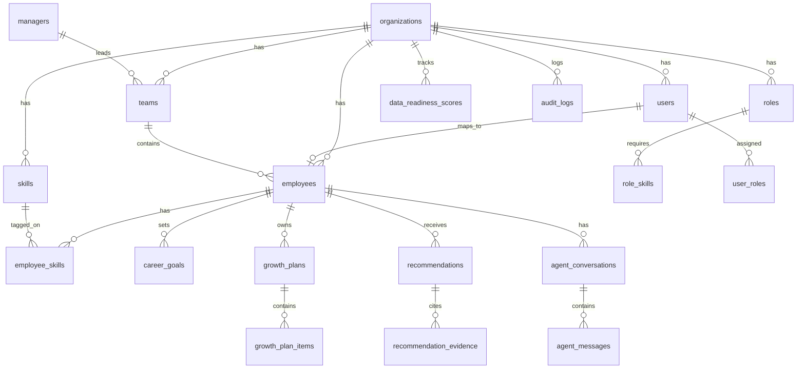

# GrowthOS Backend Structure

> **Status**: Canonical source of truth  
> **Version**: 1.0  
> **Last updated**: 2026-06-07  
> **Related docs**: [PRD.md](./PRD.md) | [TECH_STACK.md](./TECH_STACK.md) | [SECURITY_AND_PRIVACY.md](./SECURITY_AND_PRIVACY.md) | [EVALS_AND_GOVERNANCE.md](./EVALS_AND_GOVERNANCE.md)

---

## 1. Overview

This document defines the data model, API contracts, service layer, agent interfaces, audit logging, and data strategies for GrowthOS MVP.

**Conventions**:
- All primary keys: `UUID` (`gen_random_uuid()`)
- All tenant tables include `organization_id`
- Timestamps: `created_at`, `updated_at` (auto-managed)
- Soft delete: `deleted_at` where noted
- Enums stored as Postgres `text` with check constraints or Drizzle enums

---

## 2. Entity Relationship Overview



---

## 3. Database Tables

### 3.1 `organizations`

| Column | Type | Constraints |
|--------|------|-------------|
| id | uuid | PK |
| name | text | NOT NULL |
| slug | text | UNIQUE, NOT NULL |
| settings | jsonb | DEFAULT '{}' |
| created_at | timestamptz | NOT NULL DEFAULT now() |
| updated_at | timestamptz | NOT NULL DEFAULT now() |

### 3.2 `users`

| Column | Type | Constraints |
|--------|------|-------------|
| id | uuid | PK |
| organization_id | uuid | FK → organizations.id, NOT NULL |
| auth_user_id | uuid | UNIQUE, links to Supabase auth.users |
| email | text | NOT NULL |
| full_name | text | NOT NULL |
| avatar_url | text | NULL |
| is_active | boolean | DEFAULT true |
| created_at | timestamptz | NOT NULL |
| updated_at | timestamptz | NOT NULL |

**Index**: `(organization_id)`, `(auth_user_id)`

### 3.3 `user_roles`

| Column | Type | Constraints |
|--------|------|-------------|
| id | uuid | PK |
| user_id | uuid | FK → users.id, NOT NULL |
| role | text | NOT NULL — enum below |
| granted_at | timestamptz | NOT NULL |
| granted_by | uuid | FK → users.id, NULL |

**Role enum**: `employee`, `manager`, `hr_admin`, `org_admin`, `executive_readonly`

**Index**: `(user_id, role)` UNIQUE

### 3.4 `employees`

| Column | Type | Constraints |
|--------|------|-------------|
| id | uuid | PK |
| organization_id | uuid | FK, NOT NULL |
| user_id | uuid | FK → users.id, UNIQUE, NOT NULL |
| team_id | uuid | FK → teams.id, NULL |
| manager_id | uuid | FK → employees.id, NULL (self-ref) |
| job_title | text | NOT NULL |
| department | text | NULL |
| hire_date | date | NULL |
| current_role_id | uuid | FK → roles.id, NULL |
| is_active | boolean | DEFAULT true |
| created_at | timestamptz | NOT NULL |
| updated_at | timestamptz | NOT NULL |

**Index**: `(organization_id)`, `(team_id)`, `(manager_id)`, `(user_id)`

### 3.5 `employee_profiles`

| Column | Type | Constraints |
|--------|------|-------------|
| id | uuid | PK |
| employee_id | uuid | FK → employees.id, UNIQUE, NOT NULL |
| bio | text | NULL |
| career_summary | text | NULL |
| onboarding_completed_at | timestamptz | NULL |
| inferred_skills_visible | boolean | DEFAULT true |
| preferences | jsonb | DEFAULT '{}' |
| created_at | timestamptz | NOT NULL |
| updated_at | timestamptz | NOT NULL |

### 3.6 `managers`

| Column | Type | Constraints |
|--------|------|-------------|
| id | uuid | PK |
| employee_id | uuid | FK → employees.id, UNIQUE, NOT NULL |
| team_id | uuid | FK → teams.id, NOT NULL |
| created_at | timestamptz | NOT NULL |

*Note: A manager is an employee with a manager record and `manager` role. **`employees.manager_id` is canonical** for direct-report RBAC queries; `managers` and `teams.manager_employee_id` are denormalized convenience for team dashboards.*

### 3.7 `teams`

| Column | Type | Constraints |
|--------|------|-------------|
| id | uuid | PK |
| organization_id | uuid | FK, NOT NULL |
| name | text | NOT NULL |
| department | text | NULL |
| manager_employee_id | uuid | FK → employees.id, NULL |
| created_at | timestamptz | NOT NULL |
| updated_at | timestamptz | NOT NULL |

**Index**: `(organization_id)`

### 3.8 `skills`

| Column | Type | Constraints |
|--------|------|-------------|
| id | uuid | PK |
| organization_id | uuid | FK, NOT NULL |
| name | text | NOT NULL |
| category | text | NULL — e.g. `technical`, `leadership`, `domain` |
| description | text | NULL |
| is_active | boolean | DEFAULT true |
| created_at | timestamptz | NOT NULL |
| updated_at | timestamptz | NOT NULL |

**Index**: `(organization_id, name)` UNIQUE

### 3.9 `employee_skills`

| Column | Type | Constraints |
|--------|------|-------------|
| id | uuid | PK |
| employee_id | uuid | FK → employees.id, NOT NULL |
| skill_id | uuid | FK → skills.id, NOT NULL |
| source | text | NOT NULL — `confirmed` \| `inferred` |
| proficiency_level | integer | 1–5, NULL |
| confidence | decimal(3,2) | 0.00–1.00, NULL (required if inferred) |
| evidence_summary | text | NULL |
| confirmed_at | timestamptz | NULL |
| confirmed_by | uuid | FK → users.id, NULL |
| created_at | timestamptz | NOT NULL |
| updated_at | timestamptz | NOT NULL |

**Index**: `(employee_id, skill_id)` UNIQUE, `(employee_id)`, `(skill_id)`

### 3.10 `roles`

| Column | Type | Constraints |
|--------|------|-------------|
| id | uuid | PK |
| organization_id | uuid | FK, NOT NULL |
| title | text | NOT NULL |
| level | text | NULL — e.g. `IC3`, `M1`, `Staff` |
| department | text | NULL |
| description | text | NULL |
| is_active | boolean | DEFAULT true |
| created_at | timestamptz | NOT NULL |
| updated_at | timestamptz | NOT NULL |

**Index**: `(organization_id, title)`

### 3.11 `role_skills`

| Column | Type | Constraints |
|--------|------|-------------|
| id | uuid | PK |
| role_id | uuid | FK → roles.id, NOT NULL |
| skill_id | uuid | FK → skills.id, NOT NULL |
| importance | text | NOT NULL — `required` \| `preferred` |
| min_proficiency | integer | 1–5, NULL |
| created_at | timestamptz | NOT NULL |

**Index**: `(role_id, skill_id)` UNIQUE

### 3.12 `career_goals`

| Column | Type | Constraints |
|--------|------|-------------|
| id | uuid | PK |
| employee_id | uuid | FK → employees.id, NOT NULL |
| target_role_id | uuid | FK → roles.id, NULL |
| title | text | NOT NULL |
| description | text | NULL |
| timeline_months | integer | NULL |
| status | text | `active` \| `achieved` \| `archived` |
| created_at | timestamptz | NOT NULL |
| updated_at | timestamptz | NOT NULL |

**Index**: `(employee_id, status)`

### 3.13 `learning_resources`

| Column | Type | Constraints |
|--------|------|-------------|
| id | uuid | PK |
| organization_id | uuid | FK, NOT NULL |
| title | text | NOT NULL |
| description | text | NULL |
| url | text | NULL |
| provider | text | NULL |
| duration_hours | decimal(5,2) | NULL |
| skill_ids | uuid[] | Array of skill FKs |
| format | text | `course` \| `book` \| `workshop` \| `mentorship` |
| is_active | boolean | DEFAULT true |
| created_at | timestamptz | NOT NULL |

### 3.14 `opportunities`

| Column | Type | Constraints |
|--------|------|-------------|
| id | uuid | PK |
| organization_id | uuid | FK, NOT NULL |
| title | text | NOT NULL |
| description | text | NULL |
| role_id | uuid | FK → roles.id, NULL |
| department | text | NULL |
| required_skill_ids | uuid[] | NULL |
| status | text | `open` \| `filled` \| `closed` |
| posted_at | timestamptz | NOT NULL |
| created_at | timestamptz | NOT NULL |

**Index**: `(organization_id, status)`

### 3.15 `growth_plans`

| Column | Type | Constraints |
|--------|------|-------------|
| id | uuid | PK |
| employee_id | uuid | FK → employees.id, NOT NULL |
| career_goal_id | uuid | FK → career_goals.id, NULL |
| target_role_id | uuid | FK → roles.id, NULL |
| title | text | NOT NULL |
| status | text | `draft` \| `active` \| `completed` \| `archived` |
| start_date | date | NOT NULL |
| end_date | date | NULL |
| created_at | timestamptz | NOT NULL |
| updated_at | timestamptz | NOT NULL |

**Index**: `(employee_id, status)`

### 3.16 `growth_plan_items`

| Column | Type | Constraints |
|--------|------|-------------|
| id | uuid | PK |
| growth_plan_id | uuid | FK → growth_plans.id, NOT NULL |
| title | text | NOT NULL |
| description | text | NULL |
| milestone_day | integer | NOT NULL — 30, 60, or 90 |
| item_type | text | `skill` \| `learning` \| `project` \| `conversation` |
| skill_id | uuid | FK → skills.id, NULL |
| learning_resource_id | uuid | FK → learning_resources.id, NULL |
| status | text | `pending` \| `in_progress` \| `completed` |
| due_date | date | NULL |
| sort_order | integer | DEFAULT 0 |
| created_at | timestamptz | NOT NULL |
| updated_at | timestamptz | NOT NULL |

**Index**: `(growth_plan_id, milestone_day)`

### 3.17 `recommendations`

| Column | Type | Constraints |
|--------|------|-------------|
| id | uuid | PK |
| organization_id | uuid | FK, NOT NULL |
| employee_id | uuid | FK → employees.id, NOT NULL |
| agent_id | text | NOT NULL — agent identifier |
| type | text | NOT NULL — see enum below |
| title | text | NOT NULL |
| explanation | text | NOT NULL |
| confidence | decimal(3,2) | NOT NULL |
| confidence_level | text | `high` \| `medium` \| `low` |
| status | text | `pending` \| `accepted` \| `dismissed` \| `expired` |
| metadata | jsonb | DEFAULT '{}' |
| created_at | timestamptz | NOT NULL |
| updated_at | timestamptz | NOT NULL |

**Type enum**: `career_path`, `skill_gap`, `learning`, `growth_plan`, `coaching`, `stretch_assignment`, `mobility`, `team_action`, `capability_plan`

**Index**: `(employee_id, status)`, `(organization_id, type)`

### 3.18 `recommendation_evidence`

| Column | Type | Constraints |
|--------|------|-------------|
| id | uuid | PK |
| recommendation_id | uuid | FK → recommendations.id, NOT NULL |
| evidence_type | text | `skill` \| `role_requirement` \| `learning_resource` \| `opportunity` \| `data_point` |
| reference_id | uuid | NULL — FK to relevant entity |
| label | text | NOT NULL |
| detail | text | NULL |
| created_at | timestamptz | NOT NULL |

**Index**: `(recommendation_id)`

### 3.19 `agent_conversations`

| Column | Type | Constraints |
|--------|------|-------------|
| id | uuid | PK |
| organization_id | uuid | FK, NOT NULL |
| user_id | uuid | FK → users.id, NOT NULL |
| employee_id | uuid | FK → employees.id, NULL — subject employee |
| agent_id | text | NOT NULL |
| context_type | text | NULL — page context |
| status | text | `active` \| `completed` |
| created_at | timestamptz | NOT NULL |
| updated_at | timestamptz | NOT NULL |

**Index**: `(user_id, created_at DESC)`, `(agent_id)`

### 3.20 `agent_messages`

| Column | Type | Constraints |
|--------|------|-------------|
| id | uuid | PK |
| conversation_id | uuid | FK → agent_conversations.id, NOT NULL |
| role | text | `user` \| `assistant` \| `system` |
| content | text | NOT NULL |
| metadata | jsonb | DEFAULT '{}' |
| governance_passed | boolean | DEFAULT true |
| created_at | timestamptz | NOT NULL |

**Index**: `(conversation_id, created_at)`

### 3.21 `data_readiness_scores`

| Column | Type | Constraints |
|--------|------|-------------|
| id | uuid | PK |
| organization_id | uuid | FK, NOT NULL |
| scope_type | text | `organization` \| `department` \| `team` |
| scope_id | uuid | NULL |
| overall_score | integer | 0–100 |
| confirmed_skills_pct | decimal(5,2) | NULL |
| profile_completeness_pct | decimal(5,2) | NULL |
| role_mapping_pct | decimal(5,2) | NULL |
| active_plans_pct | decimal(5,2) | NULL |
| calculated_at | timestamptz | NOT NULL |
| created_at | timestamptz | NOT NULL |

**Index**: `(organization_id, scope_type, calculated_at DESC)`

### 3.22 `audit_logs`

| Column | Type | Constraints |
|--------|------|-------------|
| id | uuid | PK |
| organization_id | uuid | FK, NOT NULL |
| user_id | uuid | FK → users.id, NULL |
| action | text | NOT NULL |
| entity_type | text | NOT NULL |
| entity_id | uuid | NULL |
| details | jsonb | DEFAULT '{}' |
| ip_address | text | NULL |
| created_at | timestamptz | NOT NULL |

**Index**: `(organization_id, created_at DESC)`, `(user_id, created_at DESC)`, `(entity_type, entity_id)`

### 3.23 `permissions` (Future fine-grained)

| Column | Type | Constraints |
|--------|------|-------------|
| id | uuid | PK |
| role | text | NOT NULL |
| resource | text | NOT NULL |
| action | text | NOT NULL |
| created_at | timestamptz | NOT NULL |

*MVP uses role-based checks in middleware; this table seeds future ACL.*

---

## 4. Suggested Indexes Summary

| Table | Index | Purpose |
|-------|-------|---------|
| employees | (manager_id) | Manager team queries |
| employee_skills | (employee_id, skill_id) UNIQUE | Skill lookup |
| growth_plans | (employee_id, status) | Active plan fetch |
| recommendations | (employee_id, status) | Pending recommendations |
| audit_logs | (organization_id, created_at DESC) | HR audit search |
| agent_conversations | (user_id, created_at DESC) | User history |

---

## 5. Auth Model

### 5.1 Flow

1. User authenticates via Supabase Auth
2. App looks up `users` by `auth_user_id`
3. Loads `user_roles` for RBAC
4. Loads `employees` record for workforce context
5. Session attached to request in middleware

### 5.2 Session Context Object

```typescript
interface SessionContext {
  userId: string;
  authUserId: string;
  organizationId: string;
  employeeId: string | null;
  roles: UserRole[];
  teamId: string | null;
  isManager: boolean;
}
```

---

## 6. RBAC Model

### 6.1 Role Permissions

| Permission | employee | manager | hr_admin | org_admin | executive_readonly |
|------------|----------|---------|----------|-----------|-------------------|
| view_own_profile | ✓ | ✓ | ✓ | ✓ | — |
| edit_own_profile | ✓ | ✓ | ✓ | ✓ | — |
| view_team_data | — | ✓ (direct) | ✓ | ✓ | aggregate |
| view_org_data | — | — | ✓ | ✓ | aggregate |
| manage_users | — | — | — | ✓ | — |
| view_audit_logs | — | — | ✓ | ✓ | — |
| invoke_agents | ✓ (own) | ✓ (team) | ✓ | ✓ | — |

### 6.2 Enforcement Points

- `middleware.ts`: Route-level role checks
- Service layer: Data scope filters (always filter by org + team)
- API handlers: Return 403 if scope violated
- RLS (Phase 8): Postgres-level enforcement

---

## 7. API Endpoint Contracts

### 7.1 Response Envelope

```typescript
type ApiResponse<T> =
  | { data: T; meta?: Record<string, unknown> }
  | { error: { code: string; message: string; details?: unknown } };
```

### 7.2 Employee Endpoints

#### `GET /api/employees/me/growth-profile`

**Auth**: employee (own data)

**Response**:
```typescript
{
  data: {
    employee: { id, jobTitle, department, currentRole },
    profile: { bio, careerSummary, onboardingCompleted },
    skills: Array<{ skillId, name, source, proficiency, confidence }>,
    activeCareerGoal: CareerGoal | null,
    activeGrowthPlan: { id, title, status, progressPct } | null,
    pendingRecommendationsCount: number
  }
}
```

#### `POST /api/employees/me/career-goals`

**Auth**: employee (own data)

**Body**:
```typescript
{
  targetRoleId: string;
  title?: string;
  description?: string;
  targetDate?: string; // ISO date
}
```

**Response**: `{ data: CareerGoal }`

**Note**: One active career goal per employee in MVP; creating a new goal archives the prior active goal.

#### `PATCH /api/employees/me/career-goals/[id]`

**Body**: `{ title?, description?, targetDate?, status? }`

#### `GET /api/employees/me/career-paths`

**Query**: `?goalId=uuid`

**Response**:
```typescript
{
  data: {
    paths: Array<{
      id: string;
      title: string;
      targetRole: Role;
      explanation: string;
      confidence: number;
      confidenceLevel: 'high' | 'medium' | 'low';
      skillOverlapPct: number;
      topGaps: SkillGap[];
    }>
  }
}
```

#### `GET /api/employees/me/skill-gaps`

**Query**: `?targetRoleId=uuid`

**Response**:
```typescript
{
  data: {
    gaps: Array<{
      skill: Skill;
      importance: 'required' | 'preferred';
      currentLevel: number | null;
      targetLevel: number;
      gapSeverity: 'critical' | 'moderate' | 'minor';
    }>
  }
}
```

#### `POST /api/growth-plans`

**Body**:
```typescript
{
  careerGoalId?: string;
  targetRoleId: string;
  pathId?: string;
}
```

**Response**: `{ data: GrowthPlanWithItems }`

#### `PATCH /api/growth-plans/[id]`

**Body**: `{ status?, items?: GrowthPlanItemUpdate[] }`

#### `GET /api/employees/me/manager-conversation-prep`

**Response**:
```typescript
{
  data: {
    agenda: string[];
    talkingPoints: string[];
    questionsToAsk: string[];
    skillsToDiscuss: Skill[];
  }
}
```

### 7.3 Manager Endpoints

#### `GET /api/manager/team-skills`

**Auth**: manager

**Response**:
```typescript
{
  data: {
    team: { id, name },
    members: Array<{
      employeeId, fullName, jobTitle,
      skills: EmployeeSkill[],
      growthPlanStatus: string | null
    }>,
    teamGaps: SkillGap[]
  }
}
```

#### `GET /api/manager/employees/[id]/summary`

**Auth**: manager (direct report only)

**Response**: Growth summary + coaching prompts + stretch suggestions

#### `GET /api/manager/coaching-prompts`

**Response**:
```typescript
{
  data: {
    prompts: Array<{
      employeeId, employeeName,
      category, prompt, context, confidence
    }>
  }
}
```

#### `GET /api/manager/team-capability-plan`

**Response**: Team goals, collective gaps, suggested actions

### 7.4 HR Endpoints

#### `GET /api/hr/skills-readiness`

**Response**:
```typescript
{
  data: {
    overall: DataReadinessScore;
    byDepartment: DataReadinessScore[];
    trends: Array<{ date, score }>;
  }
}
```

#### `GET /api/hr/mobility-insights`

**Response**: Open opportunities, match rates, movement stats

#### `GET /api/hr/adoption-metrics`

**Response**: Growth plan adoption by department

#### `GET /api/hr/talent-density`

**Response**: Top skills by depth, department breakdown

#### `GET /api/hr/workforce-readiness`

**Response**: Role demand vs skills supply

#### `GET /api/hr/audit-logs`

**Query**: `?page=1&limit=50&action=&userId=`

### 7.5 Recommendation Endpoints

#### `GET /api/recommendations/[id]`

**Response**: Full recommendation with evidence array

#### `PATCH /api/recommendations/[id]`

**Body**: `{ status: 'accepted' | 'dismissed', feedback?: string }`

### 7.6 Agent Endpoints

#### `POST /api/agents/[agentId]/invoke`

**Auth**: Role-scoped

**Body**:
```typescript
{
  conversationId?: string;
  message: string;
  context?: {
    page: string;
    employeeId?: string;
    metadata?: Record<string, unknown>;
  };
}
```

**Response**:
```typescript
{
  data: {
    conversationId: string;
    message: string;
    recommendations?: Recommendation[];
    governancePassed: boolean;
  }
}
```

**Agent IDs**: `employee-growth`, `supermanager`, `skills-intelligence`, `dynamic-learning`, `internal-mobility`, `governance`

---

## 8. Service Layer Structure

```
src/services/
├── employee-service.ts
├── skills-service.ts
├── growth-plan-service.ts
├── career-goal-service.ts
├── recommendation-service.ts
├── learning-service.ts
├── mobility-service.ts
├── manager-service.ts
├── hr-service.ts
├── agent-service.ts
├── governance-service.ts
├── audit-service.ts
└── data-provider/
    ├── index.ts          # Switches mock vs live
    ├── mock-provider.ts
    └── supabase-provider.ts
```

### 8.1 Service Rules

- Services accept `SessionContext` as first parameter
- No direct DB access from route handlers
- All external calls (LLM) through agent-service
- All recommendation creation through recommendation-service

---

## 9. Agent Service Contracts

### 9.1 Agent Interface

```typescript
interface Agent {
  id: string;
  name: string;
  invoke(params: AgentInvokeParams): Promise<AgentResult>;
}

interface AgentInvokeParams {
  session: SessionContext;
  message: string;
  context: AgentContext;
  conversationHistory: Message[];
}

interface AgentResult {
  response: string;
  recommendations: CreateRecommendationInput[];
  metadata: Record<string, unknown>;
}
```

### 9.2 Agent Pipeline

```
User request
  → agent-service.invoke(agentId)
  → Load grounding data (skills, roles, etc.)
  → Build prompt from template + data
  → LLM complete (or mock)
  → Parse structured output (Zod)
  → governance-service.validate(output)
  → If pass: save recommendations + messages
  → If fail: return safe fallback + audit block event
```

### 9.3 Grounding Requirements

Each agent must load from DB/mock:

| Agent | Required Grounding |
|-------|-------------------|
| employee-growth | employee_skills, career_goals, roles, growth_plans |
| supermanager | team employees, their skills, growth_plans |
| skills-intelligence | employee_skills, role_skills |
| dynamic-learning | skill gaps, learning_resources |
| internal-mobility | employee_skills, opportunities, career_goals |
| governance | Output text + recommendation payloads |

---

## 10. Recommendation Model

### 10.1 Creation Flow

1. Agent produces `CreateRecommendationInput[]`
2. `recommendation-service.create()` validates with Zod
3. Computes `confidence_level` from `confidence` score
4. Creates `recommendations` + `recommendation_evidence` rows
5. Logs to `audit_logs`

### 10.2 Zod Schema (Conceptual)

```typescript
const CreateRecommendationSchema = z.object({
  type: z.enum(['career_path', 'skill_gap', 'learning', ...]),
  title: z.string().min(5).max(200),
  explanation: z.string().min(20).max(2000),
  confidence: z.number().min(0).max(1),
  evidence: z.array(z.object({
    evidenceType: z.enum(['skill', 'role_requirement', ...]),
    referenceId: z.string().uuid().optional(),
    label: z.string(),
    detail: z.string().optional(),
  })).min(1),
});
```

---

## 11. Audit Logging Model

### 11.1 Logged Actions

| Action | Entity | When |
|--------|--------|------|
| `recommendation.created` | recommendation | Agent creates recommendation |
| `recommendation.accepted` | recommendation | User accepts |
| `recommendation.dismissed` | recommendation | User dismisses |
| `recommendation.blocked` | agent | Recommendation output blocked by governance |
| `agent.invocation` | agent | Agent called |
| `agent.invocation.blocked` | agent | Invocation blocked by governance |
| `agent.response` | agent | Agent response returned |
| `agent_action.updated` | agent_proposed_action | Proposed action status change |
| `action_plan_blocked` | agent_action_plan | Action plan blocked by governance |
| `decision.created` / `decision.updated` | workforce_decision | Decision lifecycle |
| `decision.outcome_recorded` | decision_outcome | Expected/actual outcome recorded |
| `team_scenario.created` / `team_scenario.updated` | team_scenario | Scenario lifecycle |
| `skill.inferred.*` | employee_skill | Inferred-skill review action |
| `role.switched` | user | Demo role switch |

Planned (not yet emitted): `growth_plan.created`, `growth_plan.activated`, `auth.login`.

### 11.2 Audit Service

```typescript
auditService.log({
  session,
  action: 'recommendation.accepted',
  entityType: 'recommendation',
  entityId: recommendationId,
  details: { previousStatus: 'pending' },
});
```

---

## 12. Mock Data Strategy

### 12.1 Directory Structure

```
data/mock/
├── organization.json
├── users.json
├── employees.json
├── teams.json
├── skills.json
├── employee-skills.json
├── roles.json
├── role-skills.json
├── career-goals.json
├── learning-resources.json
├── opportunities.json
├── growth-plans.json
├── recommendations.json
└── data-readiness.json
```

### 12.2 Mock Organization

- **Org**: TechForward Inc. (engineering company)
- **12 employees**: 10 ICs, 2 managers
- **2 teams**: Platform Engineering, Product Engineering
- **1 HR admin**, **1 org admin**
- **20 skills**, **6 roles**, **10 learning resources**, **5 opportunities**

### 12.3 Feature Flag

```bash
USE_MOCK_DATA=true   # Services use mock-provider
USE_MOCK_AGENTS=true # Agent responses from fixtures, no LLM
```

### 12.4 Mock Agent Responses

`data/mock/agent-responses/` — canned JSON per agent + scenario for deterministic UI dev.

---

## 13. Supabase / Postgres Setup Guidance

### 13.1 Phase 8 Steps

1. Create Supabase project
2. Set `DATABASE_URL` (pooler) and `DIRECT_URL` (migrations)
3. Run Drizzle migrations
4. Enable RLS on all tables
5. Create policies per role (see [SECURITY_AND_PRIVACY.md](./SECURITY_AND_PRIVACY.md))
6. Seed with `drizzle/seed/` script (port mock data)
7. Set `USE_MOCK_DATA=false`

### 13.2 Connection in Drizzle

```typescript
// src/lib/db/index.ts
import { drizzle } from 'drizzle-orm/postgres-js';
import postgres from 'postgres';

const client = postgres(process.env.DATABASE_URL!);
export const db = drizzle(client, { schema });
```

---

## 14. Future Integration Strategy

| System | Integration Type | Priority |
|--------|------------------|----------|
| Workday | Read: employees, roles, skills | Post-MVP |
| SuccessFactors | Read: learning completions | Post-MVP |
| LinkedIn Learning | Read: course catalog | Post-MVP |
| Greenhouse | Read: internal postings | Post-MVP |
| Slack | Notify: growth milestones | Future |

**Adapter pattern**:

```
src/integrations/
├── types.ts
├── mock-hris-adapter.ts
├── sync-hris-read.ts
├── workday/index.ts          # read-only stub
└── successfactors/index.ts   # read-only stub
```

Controlled by `USE_HRIS_READ=true` (default false). Sync stub: `syncHrisReadFabric(organizationId)`.

All integrations write to canonical tables (`skills`, `employee_skills`, etc.) — never bypass service layer.

---

## 15. Workforce Intelligence entities (Phase WI)

See [WORKFORCE_INTELLIGENCE.md](./WORKFORCE_INTELLIGENCE.md). Migration: `0002_workforce_intelligence.sql`, RLS: `0003_workforce_intelligence_rls.sql`.

**New tables:** `business_priorities`, `projects`, `project_memberships`, `workforce_context_edges`, `workforce_decisions`, `decision_evidence`, `decision_outcomes`, `decision_participants`, `team_scenarios`, `team_scenario_roles`, `team_scenario_skills`, `role_evolution_scenarios`, `role_task_changes`, `agent_action_plans`, `agent_proposed_actions`.

**Services:** `context-graph-service`, `workforce-decision-service`, `team-scenario-service`, `decision-outcome-service`, `organizational-learning-service`, `agent-action-service`, `action-plan-governance`.

**API routes:** `/api/decisions`, `/api/decisions/[id]`, `/api/decisions/[id]/outcomes`, `/api/team-scenarios`, `/api/context/employee/[id]`, `/api/context/team/[id]`, `/api/organizational-learning`, `/api/agent-actions`.

---

## 16. Cross-References

- Product requirements: [PRD.md](./PRD.md)
- UI routes: [APP_FLOW.md](./APP_FLOW.md)
- Security: [SECURITY_AND_PRIVACY.md](./SECURITY_AND_PRIVACY.md)
- AI governance: [EVALS_AND_GOVERNANCE.md](./EVALS_AND_GOVERNANCE.md)
