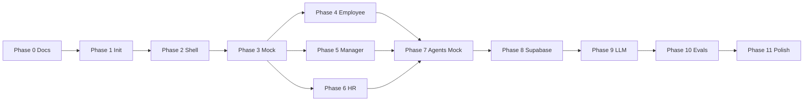

# GrowthOS Implementation Plan

> **Status**: Canonical source of truth  
> **Version**: 1.0  
> **Last updated**: 2026-06-07  
> **Related docs**: [PRD.md](./PRD.md) | [TECH_STACK.md](./TECH_STACK.md) | [APP_FLOW.md](./APP_FLOW.md) | [BACKEND_STRUCTURE.md](./BACKEND_STRUCTURE.md)

---

## 1. Overview

This plan breaks GrowthOS MVP implementation into 12 phases (0–11) with numbered atomic tasks. Each task is independently executable by Cursor.

**Rules**:
- Complete phases in order unless explicitly noted
- Update `progress.txt` after each task
- Do not skip documentation references
- Do not write application code before Phase 0 is complete

---

## Phase 0: Documentation Setup

**Goal**: Establish canonical documentation as source of truth.

| Task | Description | Acceptance Criteria |
|------|-------------|---------------------|
| 0.1 | Create `/docs` directory structure | All 8 doc files exist |
| 0.2 | Write PRD.md | All PRD sections per spec |
| 0.3 | Write APP_FLOW.md | All routes, flows, states documented |
| 0.4 | Write TECH_STACK.md | Stack locked; forbidden list included |
| 0.5 | Write FRONTEND_GUIDELINES.md | Colors, typography, patterns defined |
| 0.6 | Write BACKEND_STRUCTURE.md | Schema, APIs, services documented |
| 0.7 | Write EVALS_AND_GOVERNANCE.md | Agent rules, test cases defined |
| 0.8 | Write SECURITY_AND_PRIVACY.md | RBAC, checklist documented |
| 0.9 | Write IMPLEMENTATION_PLAN.md | This document |
| 0.10 | Write CLAUDE.md | AI operating manual complete |
| 0.11 | Initialize progress.txt | Phase 0 status recorded |
| 0.12 | Cross-reference review | All docs link correctly; FR IDs consistent |

**Phase 0 exit**: Stakeholder review of docs; open questions noted in progress.txt.

---

## Phase 1: Project Initialization

**Goal**: Scaffold Next.js project with approved toolchain.

| Task | Description | Acceptance Criteria |
|------|-------------|---------------------|
| 1.1 | Run `create-next-app` with TypeScript, Tailwind, App Router, ESLint | Project boots `npm run dev` |
| 1.2 | Enable `strict: true` in tsconfig | No implicit any |
| 1.3 | Configure path aliases (`@/` → `src/`) | Imports resolve |
| 1.4 | Initialize shadcn/ui with GrowthOS theme tokens | Button, Card render |
| 1.5 | Add CSS variables from FRONTEND_GUIDELINES | Colors match spec |
| 1.6 | Install core deps: TanStack Query, Zod, Lucide, date-fns | package.json updated |
| 1.7 | Create folder structure per TECH_STACK.md | `src/app`, `components`, `services`, `lib`, `schemas` |
| 1.8 | Add `.env.example` per SECURITY_AND_PRIVACY.md | No real secrets |
| 1.9 | Configure ESLint + Prettier | `npm run lint` passes |
| 1.9a | Add `npm run typecheck` script (`tsc --noEmit`) | Typecheck runs clean on scaffold |
| 1.10 | Add Vitest + RTL config | `npm run test` runs (empty suite OK) |
| 1.11 | Create root README.md (minimal) | Points to `/docs` |
| 1.12 | Update progress.txt → Phase 1 complete | Recorded |

---

## Phase 2: App Shell and Routing

**Goal**: Authenticated layout, navigation, route stubs.

| Task | Description | Acceptance Criteria |
|------|-------------|---------------------|
| 2.1 | Create `(auth)` layout for `/login` | Login page renders |
| 2.2 | Create `(app)` layout with Sidebar + TopBar | Shell visible |
| 2.3 | Implement role-based sidebar nav per APP_FLOW.md | Nav items per role |
| 2.4 | Create PageHeader shared component | Used on stub pages |
| 2.5 | Stub all employee routes (5 pages) | Each returns placeholder |
| 2.6 | Stub all manager routes (5 pages) | Each returns placeholder |
| 2.7 | Stub all HR routes (5 pages) | Each returns placeholder |
| 2.8 | Stub `/onboarding` and `/settings` | Pages render |
| 2.9 | Add middleware.ts with route protection (mock auth OK) | Unauthenticated → `/login` |
| 2.10 | Implement demo role switcher in Settings | Nav changes on switch |
| 2.11 | Add 404 and 403 pages | Styled per FRONTEND_GUIDELINES |
| 2.12 | Update progress.txt → Phase 2 complete | Recorded |

---

## Phase 3: Mock Data and Type System

**Goal**: Zod schemas, TypeScript types, mock fixtures.

| Task | Description | Acceptance Criteria |
|------|-------------|---------------------|
| 3.1 | Define Zod schemas for all entities in BACKEND_STRUCTURE.md | `src/schemas/` complete |
| 3.2 | Export TypeScript types from schemas (`z.infer`) | Types used in services |
| 3.3 | Create mock JSON fixtures in `data/mock/` | Org with 12 employees |
| 3.4 | Implement `mock-provider.ts` data access layer | Reads JSON fixtures |
| 3.5 | Implement `data-provider/index.ts` with `USE_MOCK_DATA` flag | Switches mock/live |
| 3.6 | Define API response envelope types | Matches BACKEND_STRUCTURE |
| 3.6a | Install `drizzle-orm`, `drizzle-kit`, `postgres` (dev) | package.json updated |
| 3.7 | Create Drizzle schema files (no migrations yet) | Mirrors DB tables |
| 3.8 | Write unit tests for Zod schemas (valid/invalid) | Tests pass |
| 3.9 | Seed mock personas: Alex, Jordan, Sam per PRD | Named in fixtures |
| 3.10 | Update progress.txt → Phase 3 complete | Recorded |

---

## Phase 4: Employee Experience

**Goal**: Wire employee pages to mock services.

| Task | Description | Acceptance Criteria |
|------|-------------|---------------------|
| 4.1 | Implement `employee-service.ts` (mock) | CRUD for profile, goals |
| 4.2 | Implement `GET /api/employees/me/growth-profile` | Returns mock data |
| 4.3 | Build `/employee/home` dashboard | KPIs, recommendations, plan preview |
| 4.4 | Build `/employee/growth-profile` page | Skills, goal, recommendations |
| 4.5 | Implement SkillChip + ConfidenceIndicator components | Per FRONTEND_GUIDELINES |
| 4.6 | Implement career goal form + `POST /api/employees/me/career-goals` | POST goal works per BACKEND_STRUCTURE |
| 4.7 | Implement `GET /api/employees/me/career-paths` | Returns ≥2 paths |
| 4.8 | Build `/employee/career-paths` page | Path cards with explanations |
| 4.9 | Implement skill gap API + display | Gaps ranked on path select |
| 4.10 | Implement `POST /api/growth-plans` + growth-plan-service | Creates 30/60/90 plan |
| 4.11 | Build GrowthPlanTimeline component | 30/60/90 milestones |
| 4.12 | Build `/employee/growth-plan` page | Edit, accept, archive |
| 4.13 | Implement manager conversation prep API | Talking points returned |
| 4.14 | Build `/employee/manager-conversation` page | Agenda, points, questions |
| 4.15 | Implement RecommendationCard + accept/dismiss | PATCH recommendation works |
| 4.16 | Add empty states per APP_FLOW.md | All employee empty states |
| 4.17 | RTL tests for SkillChip, RecommendationCard | Tests pass |
| 4.18 | Update progress.txt → Phase 4 complete | Recorded |

---

## Phase 5: Manager Experience

**Goal**: Wire manager pages to mock services.

| Task | Description | Acceptance Criteria |
|------|-------------|---------------------|
| 5.1 | Implement `manager-service.ts` (mock) | Team scope enforced |
| 5.2 | Implement `GET /api/manager/team-skills` | Direct reports only |
| 5.3 | Build TeamSkillsHeatmap component | Table/heatmap renders |
| 5.4 | Build `/manager/home` dashboard | KPIs, actions, team cards |
| 5.5 | Build `/manager/team-skills` page | Full team matrix |
| 5.6 | Implement `GET /api/manager/employees/[id]/summary` | 403 for non-reports |
| 5.7 | Build `/manager/employee/[id]` page | Growth summary, prompts |
| 5.8 | Implement coaching prompts API | Per-employee prompts |
| 5.9 | Build `/manager/coaching` page | Coaching cards |
| 5.10 | Implement stretch assignment suggestions | Display on employee detail |
| 5.11 | Implement team capability plan API | Team gaps + actions |
| 5.12 | Build `/manager/team-capability-plan` page | Timeline + actions |
| 5.13 | Add manager empty states | Per APP_FLOW.md |
| 5.14 | Update progress.txt → Phase 5 complete | Recorded |

---

## Phase 6: HR / Admin Experience

**Goal**: Wire HR dashboards to mock services.

| Task | Description | Acceptance Criteria |
|------|-------------|---------------------|
| 6.0 | Install `recharts` | Charts render on HR pages |
| 6.1 | Implement `hr-service.ts` (mock) | Org-scoped aggregates |
| 6.2 | Implement `GET /api/hr/skills-readiness` | Score + dept breakdown |
| 6.3 | Build DataReadinessScorecard component | Score + dimensions |
| 6.4 | Build `/hr/home` dashboard | KPI row includes adoption (FR-HR-003) + top skill gaps (FR-HR-005) |
| 6.5 | Build `/hr/skills-readiness` page | Charts + dept table |
| 6.6 | Implement `GET /api/hr/mobility-insights` | Match rates, opportunities |
| 6.7 | Build `/hr/mobility-insights` page | Mobility funnel viz |
| 6.8 | Implement `GET /api/hr/adoption-metrics` | Plan adoption % |
| 6.9 | Implement `GET /api/hr/talent-density` | Simplified density chart |
| 6.10 | Build `/hr/talent-density` page | Bar chart by skill |
| 6.11 | Implement `GET /api/hr/workforce-readiness` | Role demand vs supply |
| 6.12 | Build `/hr/workforce-readiness` page | Readiness table |
| 6.13 | Build KpiCard shared component | Used across HR + manager |
| 6.14 | Add HR empty states | Per APP_FLOW.md |
| 6.15 | Update progress.txt → Phase 6 complete | Recorded |

---

## Phase 7: Agent Response Layer (Mock)

**Goal**: Agent UI and mock agent responses without live LLM.

| Task | Description | Acceptance Criteria |
|------|-------------|---------------------|
| 7.1 | Implement `governance-service.ts` with keyword filter | Blocks prohibited patterns |
| 7.2 | Implement `recommendation-service.ts` | Create with evidence |
| 7.3 | Implement `audit-service.ts` | Logs key actions |
| 7.4 | Create mock agent responses in `data/mock/agent-responses/` | Per agent scenarios |
| 7.5 | Implement `agent-service.ts` with mock mode | Returns canned responses |
| 7.6 | Implement `POST /api/agents/[agentId]/invoke` | All 6 agents routable |
| 7.7 | Build AgentPanel component | Message list + input |
| 7.8 | Integrate AgentPanel on employee growth-profile | Invoke `employee-growth`, `internal-mobility`, `skills-intelligence`, `dynamic-learning` |
| 7.9 | Integrate AgentPanel on manager coaching | Invoke `supermanager` |
| 7.10 | Wire agent outputs to RecommendationCard creation | Recommendations appear |
| 7.11 | Implement governance block UI | Safe fallback message |
| 7.12 | Unit tests for governance prohibited patterns | GV test cases pass |
| 7.13 | Unit tests for recommendation creation schema | QM-05 compliance |
| 7.14 | Update progress.txt → Phase 7 complete | Recorded |

---

## Phase 8: Supabase Backend and Persistence

**Goal**: Replace mock data with live Supabase Postgres.

| Task | Description | Acceptance Criteria |
|------|-------------|---------------------|
| 8.0 | Install `@supabase/supabase-js`, `@supabase/ssr` | Auth client available |
| 8.1 | Create Supabase project | URL + keys in .env.local |
| 8.2 | Configure Drizzle with DATABASE_URL | Connection succeeds |
| 8.3 | Generate and run initial migration | All tables created |
| 8.4 | Implement `supabase-provider.ts` | CRUD for core entities |
| 8.5 | Set `USE_MOCK_DATA=false` path | Services use Supabase |
| 8.6 | Implement Supabase Auth (email/password) | Login works |
| 8.7 | Link `users.auth_user_id` on signup | User-employee mapping |
| 8.8 | Enable RLS on all tables | RLS active |
| 8.9 | Create RLS policies per SECURITY_AND_PRIVACY.md | Role tests pass |
| 8.10 | Port mock seed data to `drizzle/seed/` | Demo org populated |
| 8.11 | Update middleware for real Supabase session | Auth flow end-to-end |
| 8.12 | Smoke test all pages with live data | No mock fallback needed |
| 8.13 | Update progress.txt → Phase 8 complete | Recorded |

---

## Phase 9: Real LLM Integration

**Goal**: Connect agent service to LLM provider abstraction.

| Task | Description | Acceptance Criteria |
|------|-------------|---------------------|
| 9.1 | Implement `lib/ai/types.ts` interface | Provider contract defined |
| 9.2 | Implement OpenAI provider | `OPENAI_API_KEY` works |
| 9.3 | Create prompt templates in `lib/ai/prompts/` | Per MVP agent |
| 9.4 | Implement structured output parsing with Zod | Schema compliance |
| 9.5 | Wire agent-service to LLM (disable mock) | `USE_MOCK_AGENTS=false` |
| 9.6 | Implement grounding data injection per agent | AR-01 satisfied |
| 9.7 | Add rate limiting on agent endpoints | 20 req/min/user |
| 9.8 | Implement agent conversation persistence | DB records created |
| 9.9 | Add streaming support to AgentPanel (optional) | Progressive render |
| 9.10 | Error handling for LLM failures | Timeout + retry UX |
| 9.11 | Update progress.txt → Phase 9 complete | Recorded |

---

## Phase 10: Evals, Audit Logging, Governance

**Goal**: Production-grade AI governance and eval suite.

| Task | Description | Acceptance Criteria |
|------|-------------|---------------------|
| 10.1 | Create `evals/` directory structure | Per EVALS_AND_GOVERNANCE |
| 10.2 | Implement golden scenario fixtures | 20+ scenarios |
| 10.3 | Write eval tests for all 6 agents | Cases EG/SM/SI/DL/IM/GV |
| 10.4 | Implement `npm run evals` script | Suite runs in CI |
| 10.5 | Add CI gate on prompt file changes | PR blocked on fail |
| 10.6 | Implement confidence score calculation | Bands match spec |
| 10.7 | Implement `GET /api/hr/audit-logs` | HR can search logs |
| 10.8 | Add audit logging to all recommendation flows | Events in DB |
| 10.9 | Build governance metrics on HR home (optional) | Block count widget |
| 10.10 | Run fairness eval cases FAIR-01–05 | Document results |
| 10.11 | Complete responsible AI checklist | All items checked |
| 10.12 | Update progress.txt → Phase 10 complete | Recorded |

---

## Phase 11: Polish, Testing, Demo Readiness

**Goal**: Ship-quality MVP for stakeholder demo.

| Task | Description | Acceptance Criteria |
|------|-------------|---------------------|
| 11.1 | Playwright E2E: employee growth flow | Onboarding → plan active |
| 11.2 | Playwright E2E: manager team review | Dashboard → employee detail |
| 11.3 | Playwright E2E: HR readiness view | Dashboard loads metrics |
| 11.4 | Accessibility audit (keyboard, contrast) | WCAG AA pass on key pages |
| 11.5 | Responsive testing at 375px, 768px, 1280px | No layout breaks |
| 11.6 | Loading skeletons on all data pages | No layout shift |
| 11.7 | Error boundary + toast notifications | Graceful failures |
| 11.8 | Performance: Lighthouse ≥ 80 on employee home | Measured |
| 11.9 | Write demo script (15-min walkthrough) | Doc in `docs/DEMO_SCRIPT.md` |
| 11.10 | Deploy to Vercel preview | URL accessible |
| 11.11 | Final security checklist (SECURITY_AND_PRIVACY §16) | All items pass |
| 11.12 | Update progress.txt → MVP complete | Phase 11 recorded |

---

## 3. Dependency Graph

**Parallelizable**: Phases 4, 5, 6 can run in parallel after Phase 3.

---

## 4. Task Execution Protocol for Cursor

When executing any task:

1. Read relevant docs (see CLAUDE.md)
2. Read `progress.txt` for current state
3. Implement only the specified task scope
4. Run lint/typecheck/tests applicable to task
5. Update `progress.txt` with task ID and status
6. Report: task ID, files changed, verification, blockers

---

## 5. Post-MVP phases (12–18)

Phases 0–11 delivered the mock-first MVP. Continued engineering and roadmap horizons H0–H6 are defined in **[IMPLEMENTATION_PLAN_POST_MVP.md](./IMPLEMENTATION_PLAN_POST_MVP.md)** (pilot persistence, audit UI, enablement Q&A, integrations, dynamic workforce, PRD v2 gate).

---

## 6. Cross-References

- Product requirements: [PRD.md](./PRD.md)
- Routes: [APP_FLOW.md](./APP_FLOW.md)
- Stack: [TECH_STACK.md](./TECH_STACK.md)
- Schema: [BACKEND_STRUCTURE.md](./BACKEND_STRUCTURE.md)
- Governance: [EVALS_AND_GOVERNANCE.md](./EVALS_AND_GOVERNANCE.md)
- Security: [SECURITY_AND_PRIVACY.md](./SECURITY_AND_PRIVACY.md)
