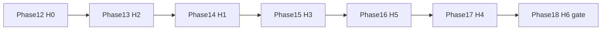

# GrowthOS Post-MVP Implementation Plan (Phases 12–18)

> **Status:** Active — Phases 0–11 complete in [`IMPLEMENTATION_PLAN.md`](./IMPLEMENTATION_PLAN.md)  
> **Last updated:** 2026-06-08  
> **Roadmap:** [`ROADMAP_AGENTIC_HCM.md`](./ROADMAP_AGENTIC_HCM.md) horizons H0–H6  
> **Prerequisite for H0:** [`PILOT_PERSISTENCE_RELEASE.md`](./PILOT_PERSISTENCE_RELEASE.md)

---

## Execution order

Recommended: H0 → H2 → H1 → H3 → H5 → H4 → H6 (gated).

---

## Phase 12 — H0 Pilot Persistence Release

**Goal:** Pilot-ready Postgres + Auth + RLS with mock fallback preserved.

| Task | Description | Acceptance Criteria |
|------|-------------|---------------------|
| 12.0 | Env verification script | `npm run db:verify-env` checks DATABASE_URL + Supabase keys |
| 12.1 | Migration runbook | `npm run db:migrate` applies 0000 + 0001 |
| 12.2 | Seed validation | `npm run db:seed` populates TechForward fixtures |
| 12.3 | Dual-path `getSessionContext()` | Supabase session when `USE_MOCK_DATA=false`; mock cookie when true |
| 12.4 | Login with Supabase Auth | Email/password when persistence mode; mock fallback preserved |
| 12.5 | Role switcher + RBAC | Demo role cookie maps to `SessionContext.roles` |
| 12.6 | RLS role matrix tests | `rbac-matrix.test.ts` covers release doc matrix |
| 12.7 | `persistRecommendation()` | Inserts `recommendations` + `recommendation_evidence` |
| 12.8 | Wire agent invoke to persist | Recommendations survive refresh when `USE_MOCK_DATA=false` |
| 12.9 | Accept/dismiss persistence | `PATCH /api/recommendations/[id]/status` + UI wiring |
| 12.10 | Audit log Postgres writes | `audit-service` dual-write; API reads DB when configured |
| 12.11 | Store loader for persisted recs | Supabase store includes agent-created recommendations |
| 12.12 | Graceful degradation | DB unavailable → in-memory + mock path |
| 12.13 | Pilot validation docs | SMOKE_TEST_CHECKLIST pilot env section |
| 12.14 | PILOT_PERSISTENCE_RELEASE checkboxes | All exit criteria checked |
| 12.15 | `progress.txt` → Phase 12 complete | Recorded |

**Validation gate:** `typecheck`, `lint`, `test`, `build`, `evals`, `smoke`.

---

## Phase 13 — H2 Decision Context (audit + rationale UI)

**Goal:** HR browses persisted audit/governance events and recommendation history.

| Task | Description | Acceptance Criteria |
|------|-------------|---------------------|
| 13.0 | Update `APP_FLOW.md` | HR audit route and export affordances documented |
| 13.1 | PRD traceability | Audit UI FR IDs in PRD if new |
| 13.2 | HR audit log page | `/hr/audit` table with filters |
| 13.3 | Recommendation history | Evidence links on recommendation cards |
| 13.4 | Governance block in audit stream | Blocked attempts visible |
| 13.5 | Export | `GET /api/hr/audit-logs/export` CSV |
| 13.6 | RLS / RBAC tests for audit API | hr_admin + org_admin only |
| 13.7 | HR audit E2E / integration test | Vitest or Playwright covers audit page load |
| 13.8 | `progress.txt` → Phase 13 complete | Recorded |

**Dependencies:** Phase 12.

---

## Phase 14 — H1 Enablement Q&A

**Goal:** Governed natural-language Q&A on existing agent surfaces.

| Task | Description | Acceptance Criteria |
|------|-------------|---------------------|
| 14.0 | PRD + APP_FLOW (if new UI) | Only when beyond AgentPanel |
| 14.1 | Employee growth Q&A prompts | `employee-growth` prompt expansion |
| 14.2 | Manager coaching Q&A prompts | `supermanager` team-scoped grounding |
| 14.3 | Eval fixtures for Q&A prohibitions | New cases in `src/evals/` |
| 14.4 | Rate limit on Q&A paths | Reuse agent rate limiter |
| 14.5 | Optional Q&A conversation persist | `agent_conversations` when DB configured |
| 14.6 | `progress.txt` → Phase 14 complete | Recorded |

**Dependencies:** Phase 12; Phase 13 recommended.

---

## Phase 15 — H3 Self-maintaining enablement data

**Goal:** Human-in-the-loop inferred skills and taxonomy suggestions.

| Task | Description | Acceptance Criteria |
|------|-------------|---------------------|
| 15.0 | APP_FLOW + PRD for review UI | Inferred-skill review flow documented |
| 15.1 | Inferred skill review workflow | Accept/reject updates profile metadata |
| 15.2 | Taxonomy suggestion surface | Skills-intelligence agent + human confirm |
| 15.3 | `src/integrations/` stub | Interface + mock adapter |
| 15.4 | Audit on taxonomy changes | `audit_logs` entries |
| 15.5 | SI agent eval expansion | New taxonomy eval cases |
| 15.6 | `progress.txt` → Phase 15 complete | Recorded |

---

## Phase 16 — H5 HRIS read fabric

**Goal:** Read-only Workday / SuccessFactors adapter stubs.

| Task | Description | Acceptance Criteria |
|------|-------------|---------------------|
| 16.0 | Integration architecture in BACKEND_STRUCTURE | Adapter contract documented |
| 16.1 | `src/integrations/workday/` stub | Read employees + job profiles (mock) |
| 16.2 | `src/integrations/successfactors/` stub | Parallel read interface |
| 16.3 | Sync job stub | Manual trigger merges into store or cache |
| 16.4 | `USE_HRIS_READ=false` default | Mock path unchanged |
| 16.5 | Cross-org scoping tests | Adapter tests enforce org boundary |
| 16.6 | `progress.txt` → Phase 16 complete | Recorded |

---

## Phase 17 — H4 Dynamic workforce

**Goal:** Onboarding wizard, work redesign and talent density agent surfaces.

| Task | Description | Acceptance Criteria |
|------|-------------|---------------------|
| 17.0 | APP_FLOW + PRD for onboarding | Replace placeholder route |
| 17.1 | Onboarding wizard + agent | `/onboarding` functional; recommendations persist |
| 17.2 | Work redesign prompts | `dynamic-learning` expansion + evals |
| 17.3 | Talent density agent surface | HR workforce-readiness agent integration |
| 17.4 | Onboarding integration test | Vitest covers wizard steps |
| 17.5 | `progress.txt` → Phase 17 complete | Recorded |

---

## Phase 18 — H6 Agentic HRIS core (gated)

**Goal:** Planning only until PRD v2 approved.

| Task | Description | Acceptance Criteria |
|------|-------------|---------------------|
| 18.0 | `docs/PRD_V2_GATE.md` draft | Explicit in/out scope for HRIS core |
| 18.1 | Architecture review notes | Enablement layer vs HRIS core boundary |
| 18.2 | Stakeholder gate in `progress.txt` | Decision recorded — **no H6 code** |
| 18.3 | Future Phases 19+ | Only after gate approval |

---

## Cross-cutting rules

1. Doc order: APP_FLOW → PRD → this plan → code → `progress.txt`.
2. `USE_MOCK_DATA=true` and `USE_MOCK_AGENTS=true` remain demo defaults.
3. No prohibited employment-decision outputs ([`EVALS_AND_GOVERNANCE.md`](./EVALS_AND_GOVERNANCE.md)).
4. One task scope per agent session; validate before marking done.

---

## Cross-references

- [`PILOT_PERSISTENCE_RELEASE.md`](./PILOT_PERSISTENCE_RELEASE.md)
- [`STRATEGY.md`](./STRATEGY.md)
- [`SECURITY_AND_PRIVACY.md`](./SECURITY_AND_PRIVACY.md)
- [`BACKEND_STRUCTURE.md`](./BACKEND_STRUCTURE.md)
