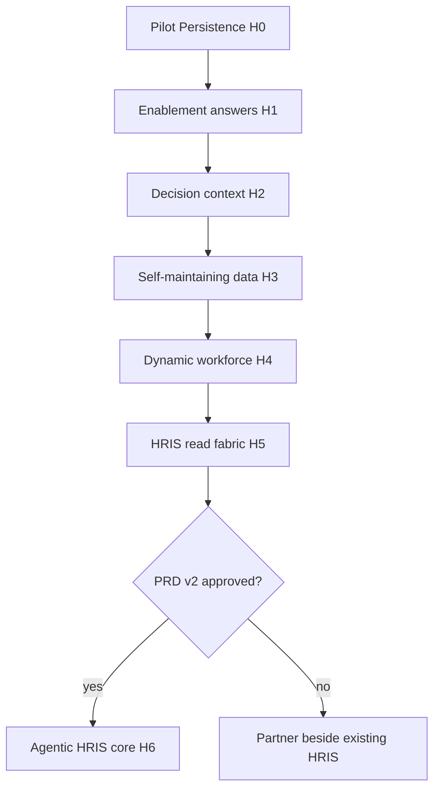

# GrowthOS Agentic HCM Roadmap

> **Status:** Strategic horizons (not yet IMPLEMENTATION_PLAN phases)  
> **Last updated:** 2026-06-08  
> **Prerequisite:** [PILOT_PERSISTENCE_RELEASE.md](./PILOT_PERSISTENCE_RELEASE.md) (Horizon H0)  
> **Related:** [STRATEGY.md](./STRATEGY.md) | [PRD.md](./PRD.md) | [IMPLEMENTATION_PLAN.md](./IMPLEMENTATION_PLAN.md) | [IMPLEMENTATION_PLAN_POST_MVP.md](./IMPLEMENTATION_PLAN_POST_MVP.md)

---

## Overview

This roadmap sequences GrowthOS from **mock demo** to **pilot-ready persistence** and beyond—toward agentic outcomes (agents power operations, answers not tickets, dynamic workforce) **without** silently expanding into full HRIS scope.

Each horizon requires **explicit approval** before new routes, agents, or IMPLEMENTATION_PLAN phases are added. Horizon H6 requires **PRD v2**.

---

## Horizon map

---

## H0 — Pilot persistence (engineering milestone)

**Theme:** Credible pilot with real auth, RLS, and persisted agent artifacts.

**Scope:** Fully defined in [PILOT_PERSISTENCE_RELEASE.md](./PILOT_PERSISTENCE_RELEASE.md).

| Work item | Exit signal |
|-----------|-------------|
| Apply Supabase migrations | `npm run db:migrate` succeeds |
| Seed demo data | `npm run db:seed` populates TechForward fixtures |
| Supabase Auth / session | `USE_MOCK_DATA=false` with real login |
| RLS role matrix tests | All roles pass automated matrix |
| Persist recommendations | Survive refresh |
| Persist accept/dismiss | Survive refresh |
| Persist audit logs | Queryable server-side |
| Mock fallback preserved | `USE_MOCK_DATA=true` still works |
| HR audit **view** | Only after [APP_FLOW.md](./APP_FLOW.md) updated |

**Non-goals:** New product features, new agents, new routes (except audit view per APP_FLOW).

**Validation:** typecheck, lint, test, build, evals, smoke.

---

## H1 — Answers, not tickets (enablement Q&A)

**Theme:** Governed natural-language answers for employees and managers on growth and readiness topics.

| In scope | Out of scope |
|----------|--------------|
| Workforce/growth Q&A via existing agents + expanded prompts | Employment-decision answers |
| Expanded eval fixtures for Q&A safety | Generic unconstrained HR chatbot |
| HR aggregate “answer” surfaces on existing dashboards | Payroll/benefits Q&A |

**Dependencies:** H0 complete.

**Exit criteria:**

- Employees can ask growth/skills questions on growth profile with governed responses
- Managers can ask team-scoped coaching questions on coaching surfaces
- Eval suite covers new Q&A prohibition cases
- No new prohibited output types introduced

**Docs gate:** PRD FR IDs for any new use cases; APP_FLOW if new UI entry points.

---

## H2 — Decision context (audit and rationale)

**Theme:** Capture and surface **why** recommendations were made—supporting “context behind workforce enablement decisions.”

| Work item | Exit signal |
|-----------|-------------|
| HR audit log UI | HR admin can browse org-scoped audit entries |
| Recommendation history | Link evidence to skills/roles in UI |
| Export | CSV or API export of audit + governance events |
| Governance block visibility | Blocked attempts visible in audit stream |

**Dependencies:** H0 (persisted audit logs).

**Exit criteria:**

- Audit entries persist across sessions
- HR admin role can access per RLS matrix
- Demo can show recommendation + block history without code walkthrough

**Docs gate:** APP_FLOW update for HR audit routes before implementation.

---

## H3 — Self-maintaining enablement data

**Theme:** Agents and workflows help maintain **skills taxonomies, role-skill maps, and inferred-skill review**—not payroll or benefits configuration.

| Work item | Exit signal |
|-----------|-------------|
| Inferred-skill review queue for org_admin | Confirm/reject flows |
| Skills taxonomy suggestions | Agent-assisted proposals with human approval |
| Role-skill gap maintenance | Org_admin workflow |
| Integration adapter framework stub | `src/integrations/` types + sync service skeleton |

**Dependencies:** H0; preferably H2 for audit of data changes.

**Exit criteria:**

- Data readiness score improves measurably in pilot
- No auto-write to canonical tables without human approval
- Adapter stub documented in BACKEND_STRUCTURE

**Non-goals:** Auto-configuring payroll, benefits, or org hierarchy in HRIS.

---

## H4 — Dynamic workforce depth

**Theme:** Mobility, planning, and onboarding for fluid teams.

| Work item | Source reference |
|-----------|------------------|
| Work redesign agent (human sign-off) | PRD future agents |
| Talent Density Agent (full) | APP_FLOW post-MVP |
| Onboarding flow (replace placeholder) | `/onboarding` stub |
| Frontline enablement (if scoped) | PRD future |

**Dependencies:** H1–H3 foundations; skills data quality.

**Exit criteria:**

- Onboarding is functional MVP flow, not placeholder
- Work redesign outputs require explicit human approval in UI
- Eval coverage for new agents

**Docs gate:** PRD + APP_FLOW + IMPLEMENTATION_PLAN Phase 12+ before coding.

---

## H5 — Enterprise fabric (HRIS read integrations)

**Theme:** Ground enablement answers in **live system-of-record data** via read-only adapters.

| Adapter | Data synced |
|---------|-------------|
| Workday (priority) | Employees, roles, skills |
| SuccessFactors | Learning completions |
| Greenhouse / internal ATS | Internal postings |
| LinkedIn Learning / LMS | Course catalog |

**Pattern:** Adapters → canonical tables → service layer ([BACKEND_STRUCTURE.md](./BACKEND_STRUCTURE.md) Section 14).

**Dependencies:** H0; customer credentials and sandbox environments.

**Exit criteria:**

- Pilot customer can sync at least one HRIS source
- Recommendations cite synced data in evidence
- Sync failures degrade gracefully (mock fallback or stale-data banner)

**Non-goals:** Write-back to HRIS in first integration wave.

---

## H6 — Agentic core expansion (gated)

**Theme:** Deliberate expansion toward **full HRIS core** scope—payroll, benefits, case management, or system-of-record replacement.

**Status:** **Not approved.** Requires PRD v2 and leadership sign-off.

**Gate checklist:**

1. Publish PRD v2 with explicit modules and revised non-goals
2. Architecture review (compliance, data model, multi-year implementation plan)
3. Update [STRATEGY.md](./STRATEGY.md) category line and [COMPETITIVE_POSITIONING.md](./COMPETITIVE_POSITIONING.md)
4. New IMPLEMENTATION_PLAN phases with acceptance criteria
5. Security and legal review for employment-decision boundaries

Until H6 is approved, public positioning remains **agentic HCM enablement layer**.

---

## Governance invariant (all horizons)

- No prohibited employment-decision outputs ([PRD.md](./PRD.md) Section 8)
- New agents pass [EVALS_AND_GOVERNANCE.md](./EVALS_AND_GOVERNANCE.md) before ship
- New routes require [APP_FLOW.md](./APP_FLOW.md) update first
- Cross-org access never allowed (RLS)

---

## Engineering touchpoints

| Area | Location |
|------|----------|
| Data provider | `src/services/data-provider/` |
| Agents | `src/services/agent-service.ts`, `src/lib/ai/prompts/` |
| Governance | `src/services/governance-service.ts` |
| Integrations | `src/integrations/` (H3 stub, H5 implementation) |
| Evals | `src/evals/` |
| Migrations | `drizzle/migrations/` |

**Doc update order:** APP_FLOW → PRD → IMPLEMENTATION_PLAN → `progress.txt`

---

## Recommended execution order

1. **H0** — Pilot Persistence Release (now)
2. **Record demo** + run design-partner conversations
3. **H2** — Audit/context UI (high pilot value)
4. **H1** — Enablement Q&A
5. **H3** — Data quality agents
6. **H5** — First HRIS read adapter (customer-driven)
7. **H4** — Onboarding + advanced agents
8. **H6** — Only if category strategy changes

---

## Horizon summary table

| Horizon | Theme | Type | Status |
|---------|-------|------|--------|
| H0 | Pilot persistence | Engineering | **Next** |
| H1 | Enablement Q&A | Product | Planned |
| H2 | Decision context | Product | Planned |
| H3 | Self-maintaining enablement data | Product | Planned |
| H4 | Dynamic workforce depth | Product | Planned |
| H5 | HRIS read fabric | Integration | Planned |
| H6 | Agentic HRIS core | Strategy gate | Not approved |
