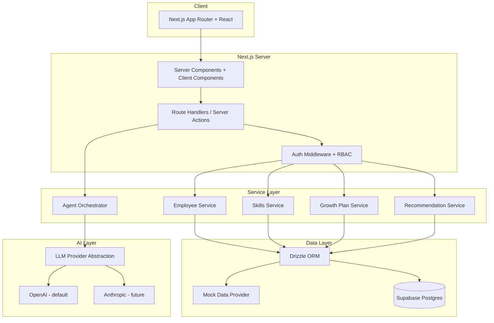

# GrowthOS Technology Stack

> **Status**: Canonical source of truth  
> **Version**: 1.0  
> **Last updated**: 2026-06-07  
> **Related docs**: [PRD.md](./PRD.md) | [BACKEND_STRUCTURE.md](./BACKEND_STRUCTURE.md) | [IMPLEMENTATION_PLAN.md](./IMPLEMENTATION_PLAN.md) | [SECURITY_AND_PRIVACY.md](./SECURITY_AND_PRIVACY.md)

---

## 1. Overview

GrowthOS uses a modern SaaS stack optimized for Cursor-driven development, rapid MVP iteration, and enterprise-ready evolution. All technology choices below are **approved**. Deviations require updating this document first.

---

## 2. Architecture Overview



**Request flow**:

1. Browser renders React via Next.js App Router
2. Client components fetch via TanStack Query → API route handlers
3. Middleware validates Supabase session + RBAC
4. Service layer executes business logic
5. Drizzle reads/writes Postgres (or mock provider when `USE_MOCK_DATA=true`)
6. Agent requests go through Governance checks before response

---

## 3. Core Technologies

| Layer | Technology | Version Guidance |
|-------|------------|------------------|
| Framework | **Next.js** (App Router) | 15.x |
| Language | **TypeScript** | 5.x, `strict: true` |
| UI Library | **React** | 19.x |
| Styling | **Tailwind CSS** | 4.x |
| Components | **shadcn/ui** | Latest compatible with Tailwind 4 |
| Data fetching | **TanStack Query** | 5.x |
| Validation | **Zod** | 4.x, `< 4.4` (zod 4.4.x breaks the Turbopack production build — verified 2026-08-02) |
| ORM | **Drizzle ORM** | Latest stable |
| Database | **Supabase Postgres** | Managed |
| Auth | **Supabase Auth** | Email/password MVP |
| Charts | **Recharts** | 2.x |
| Icons | **Lucide React** | Latest |
| AI | **Custom abstraction** in `lib/ai/` | Provider-swappable |
| Unit tests | **Vitest** | 2.x |
| Component tests | **React Testing Library** | Latest |
| E2E tests | **Playwright** | Latest |
| Linting | **ESLint** | 9.x flat config |
| Formatting | **Prettier** | 3.x |
| Deployment | **Vercel** | Production + previews |

### 3.1 Why Drizzle over Prisma

- SQL-transparent schema close to Postgres
- Lightweight bundle for serverless
- Strong TypeScript inference
- Works well with Supabase connection pooling
- Easier raw SQL for analytics queries (HR dashboards)

Documented in [PRD.md](./PRD.md) Assumptions.

---

## 4. Frontend Stack

### 4.1 Directory Structure (Target)

```
src/
├── app/                    # Next.js App Router
│   ├── (auth)/             # login, onboarding
│   ├── (app)/              # authenticated layout
│   │   ├── employee/
│   │   ├── manager/
│   │   ├── hr/
│   │   └── settings/
│   └── api/                # Route handlers
├── components/
│   ├── ui/                 # shadcn primitives
│   ├── layout/             # Sidebar, TopBar
│   ├── employee/
│   ├── manager/
│   ├── hr/
│   ├── agents/             # Agent panels
│   └── shared/             # RecommendationCard, SkillChip, etc.
├── hooks/
├── lib/
│   ├── ai/                 # LLM abstraction
│   ├── auth/
│   ├── db/                 # Drizzle client
│   └── utils/
├── services/               # Business logic
├── schemas/                # Zod schemas (shared)
└── types/
```

### 4.2 Key Frontend Packages

```json
{
  "dependencies": {
    "next": "^15.0.0",
    "react": "^19.0.0",
    "react-dom": "^19.0.0",
    "@tanstack/react-query": "^5.0.0",
    "zod": "^3.23.0",
    "recharts": "^2.12.0",
    "lucide-react": "^0.400.0",
    "class-variance-authority": "^0.7.0",
    "clsx": "^2.1.0",
    "tailwind-merge": "^2.3.0",
    "date-fns": "^3.6.0"
  },
  "devDependencies": {
    "typescript": "^5.5.0",
    "tailwindcss": "^4.0.0",
    "vitest": "^2.0.0",
    "@testing-library/react": "^16.0.0",
    "@playwright/test": "^1.45.0",
    "eslint": "^9.0.0",
    "prettier": "^3.3.0"
  }
}
```

Exact versions pinned at project init (Phase 1).

### 4.3 Rendering Strategy

| Content Type | Strategy |
|--------------|----------|
| Dashboard shells, static copy | Server Components |
| Interactive charts, forms, agent panels | Client Components |
| User-specific data | Client fetch via TanStack Query |
| Auth-gated pages | Middleware + server session check |

---

## 5. Backend Stack

### 5.1 API Pattern

- **Route handlers** in `src/app/api/` for REST-style endpoints
- **Server Actions** only for simple form mutations (prefer route handlers for agent endpoints)
- All inputs validated with Zod schemas from `src/schemas/`
- All responses typed and consistent error envelope:

```typescript
// Success
{ "data": T, "meta"?: object }

// Error
{ "error": { "code": string, "message": string, "details"?: unknown } }
```

### 5.2 Service Layer

Business logic lives in `src/services/`, not in route handlers or components.

| Service | Responsibility |
|---------|----------------|
| `employee-service` | Profiles, career goals |
| `skills-service` | Skills, gaps, inference results |
| `growth-plan-service` | Plans, milestones |
| `recommendation-service` | Recommendations, evidence |
| `manager-service` | Team views, coaching |
| `hr-service` | Org dashboards, readiness |
| `agent-service` | Agent orchestration |
| `audit-service` | Audit logging |
| `governance-service` | Output policy checks |

### 5.3 Mock Data Provider

When `USE_MOCK_DATA=true`:

- Services read from `data/mock/*.json`
- No Supabase connection required
- Same Zod schemas validate mock and live data
- Feature parity for UI development (Phases 3–7)

---

## 6. Database Stack

### 6.1 Supabase Configuration

- **Postgres** for all relational data
- **Supabase Auth** for users/sessions
- **Row Level Security (RLS)** enabled on all tenant tables (Phase 8)
- **Connection**: `DATABASE_URL` for Drizzle (pooled); direct URL for migrations

### 6.2 Drizzle Setup

```
drizzle/
├── schema/           # Table definitions
├── migrations/       # SQL migrations
└── seed/             # Seed scripts
```

- Migrations via `drizzle-kit`
- Schema mirrors [BACKEND_STRUCTURE.md](./BACKEND_STRUCTURE.md)

### 6.3 Caching

- TanStack Query client-side cache (stale times per resource type)
- No Redis in MVP
- Future: Vercel KV for rate limiting / session cache if needed

---

## 7. Authentication Approach

| Concern | Implementation |
|---------|----------------|
| Identity | Supabase Auth (`auth.users`) |
| App user | `users` table linked via `auth_user_id` |
| Session | `@supabase/ssr` cookie-based sessions |
| Middleware | `src/middleware.ts` — protect `(app)` routes |
| Roles | `user_roles` table; checked server-side |
| Demo role switch | Client-side role override in dev/demo only; server still enforces real RBAC in production |

**MVP auth methods**: Email + password. OAuth (Google) optional Phase 8+.

---

## 8. AI Provider Abstraction

### 8.1 Interface

```typescript
// src/lib/ai/types.ts
interface LLMProvider {
  id: string;
  complete(params: CompletionParams): Promise<CompletionResult>;
  stream?(params: CompletionParams): AsyncIterable<CompletionChunk>;
}

interface CompletionParams {
  systemPrompt: string;
  messages: Message[];
  temperature?: number;
  maxTokens?: number;
  responseFormat?: 'text' | 'json';
}
```

### 8.2 Providers

| Provider | Status | Env Var |
|----------|--------|---------|
| OpenAI | MVP default | `OPENAI_API_KEY` |
| Anthropic | Future | `ANTHROPIC_API_KEY` |
| Mock | Phases 3–7 | `USE_MOCK_AGENTS=true` |

### 8.3 Rules

- **Never** call LLM APIs from client components
- All agent calls go through `agent-service` → `governance-service` → `LLMProvider`
- Prompts live in `src/lib/ai/prompts/` (version controlled)
- Structured outputs validated with Zod after LLM response

---

## 9. Testing Approach

| Level | Tool | Scope |
|-------|------|-------|
| Unit | Vitest | Services, schemas, utils, governance |
| Component | Vitest + RTL | RecommendationCard, SkillChip, forms |
| Integration | Vitest | API routes with mock DB |
| E2E | Playwright | Critical flows per [APP_FLOW.md](./APP_FLOW.md) |
| AI Evals | Custom scripts | See [EVALS_AND_GOVERNANCE.md](./EVALS_AND_GOVERNANCE.md) |

**CI** (Phase 11): GitHub Actions — lint, typecheck, unit tests, eval regression on prompt changes.

---

## 10. Linting and Formatting

| Tool | Config |
|------|--------|
| ESLint | `eslint-config-next` + TypeScript rules |
| Prettier | Single quotes, trailing commas, 100 print width |
| TypeScript | `strict`, `noUncheckedIndexedAccess` recommended |

**Pre-commit** (optional Phase 11): lint-staged for changed files.

---

## 11. Deployment Target

| Environment | Platform | Branch |
|-------------|----------|--------|
| Production | Vercel | `main` |
| Preview | Vercel | PR branches |
| Local | `next dev` | — |

### 11.1 Environment Variables

| Variable | Required | Client-safe |
|----------|----------|-------------|
| `NEXT_PUBLIC_SUPABASE_URL` | Phase 8+ | Yes |
| `NEXT_PUBLIC_SUPABASE_ANON_KEY` | Phase 8+ | Yes |
| `SUPABASE_SERVICE_ROLE_KEY` | Phase 8+ | **No** |
| `DATABASE_URL` | Phase 8+ | **No** |
| `OPENAI_API_KEY` | Phase 9+ | **No** |
| `USE_MOCK_DATA` | Phases 3–7 | **No** |
| `USE_MOCK_AGENTS` | Phases 3–7 | **No** |

Full security rules: [SECURITY_AND_PRIVACY.md](./SECURITY_AND_PRIVACY.md)

---

## 12. Local Development Expectations

### 12.1 Phase 3–7 (Mock Mode)

```bash
USE_MOCK_DATA=true
USE_MOCK_AGENTS=true
npm run dev
```

No Supabase or OpenAI keys required.

### 12.2 Phase 8+ (Full Stack)

```bash
# .env.local
NEXT_PUBLIC_SUPABASE_URL=...
NEXT_PUBLIC_SUPABASE_ANON_KEY=...
SUPABASE_SERVICE_ROLE_KEY=...
DATABASE_URL=...
OPENAI_API_KEY=...        # Phase 9
USE_MOCK_DATA=false
USE_MOCK_AGENTS=false
```

```bash
npm run db:migrate
npm run db:seed
npm run dev
```

### 12.3 Required Node Version

- **Node.js 20 LTS** or **22 LTS**
- Package manager: **npm** (default) or **pnpm** (document if switched)

---

## 13. Explicitly Forbidden Tech Choices

Do **not** introduce these without updating this document and [IMPLEMENTATION_PLAN.md](./IMPLEMENTATION_PLAN.md):

| Forbidden | Reason |
|-----------|--------|
| MongoDB / NoSQL primary store | Relational workforce data model |
| GraphQL-only API | REST route handlers sufficient for MVP |
| Redux / MobX | TanStack Query + React state enough |
| CSS-in-JS (styled-components, emotion) | Tailwind + shadcn standard |
| Raw SQL in React components | Must use service layer |
| Direct LLM calls in UI | Security + governance bypass |
| Prisma | Drizzle is the approved ORM |
| Firebase | Supabase is the approved BaaS |
| Hardcoded API keys | Env vars only |
| jQuery / legacy UI libs | React 19 + shadcn |
| Bootstrap / Material UI | shadcn/ui design system |

---

## 14. Future Technology Considerations (Post-MVP)

| Need | Candidate |
|------|-----------|
| Background jobs | Inngest or Supabase Edge Functions |
| Search | Postgres full-text or Typesense |
| Feature flags | Vercel Flags or LaunchDarkly |
| Observability | Vercel Analytics + Sentry |
| Enterprise SSO | Supabase SAML / WorkOS |
| HRIS integration | Custom adapters (Workday, SF) |

**Workforce Context Graph (Phase WI):** Implemented with Postgres relational edges (`workforce_context_edges`)—no graph database in this iteration. Query via `context-graph-service` helpers.

---

## 15. Cross-References

- Data model: [BACKEND_STRUCTURE.md](./BACKEND_STRUCTURE.md)
- UI implementation: [FRONTEND_GUIDELINES.md](./FRONTEND_GUIDELINES.md)
- Build phases: [IMPLEMENTATION_PLAN.md](./IMPLEMENTATION_PLAN.md)
- AI governance: [EVALS_AND_GOVERNANCE.md](./EVALS_AND_GOVERNANCE.md)
